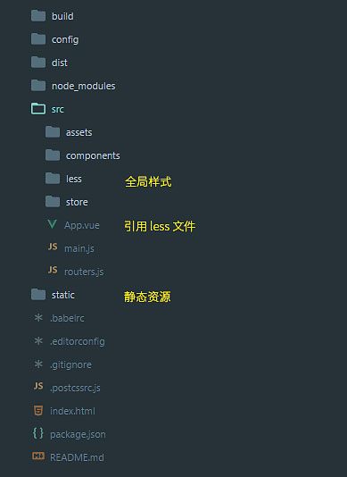

## 简介

一个比较适合自己使用习惯的 Webpack + Vue 文档结构，以及一些常用的依赖。

## 文档结构



使用绝对路径引用 `static` 文件夹的文件（不做处理）：

``

使用相对路径引用 `assets` 文件夹的文件（相当于作为模块来加载）：

``

关于资源路径的问题可以看[这篇文章](http://blog.csdn.net/fungleo/article/details/77799057)

## 输出生产文件

最终生成到 `/dist` 的文件需要在服务器环境下才可以正常浏览，可以在本机安装 [http-server](https://www.npmjs.com/package/http-server) 模拟服务器环境：

全局安装 `http-server`：

```bash
npm install http-server -g
```

安装好后运行：

```bash
http-server -p 3000 -o
```

在浏览器里访问 `http://127.0.0.1:3000` 即可浏览生成的 `/dist` 网页。